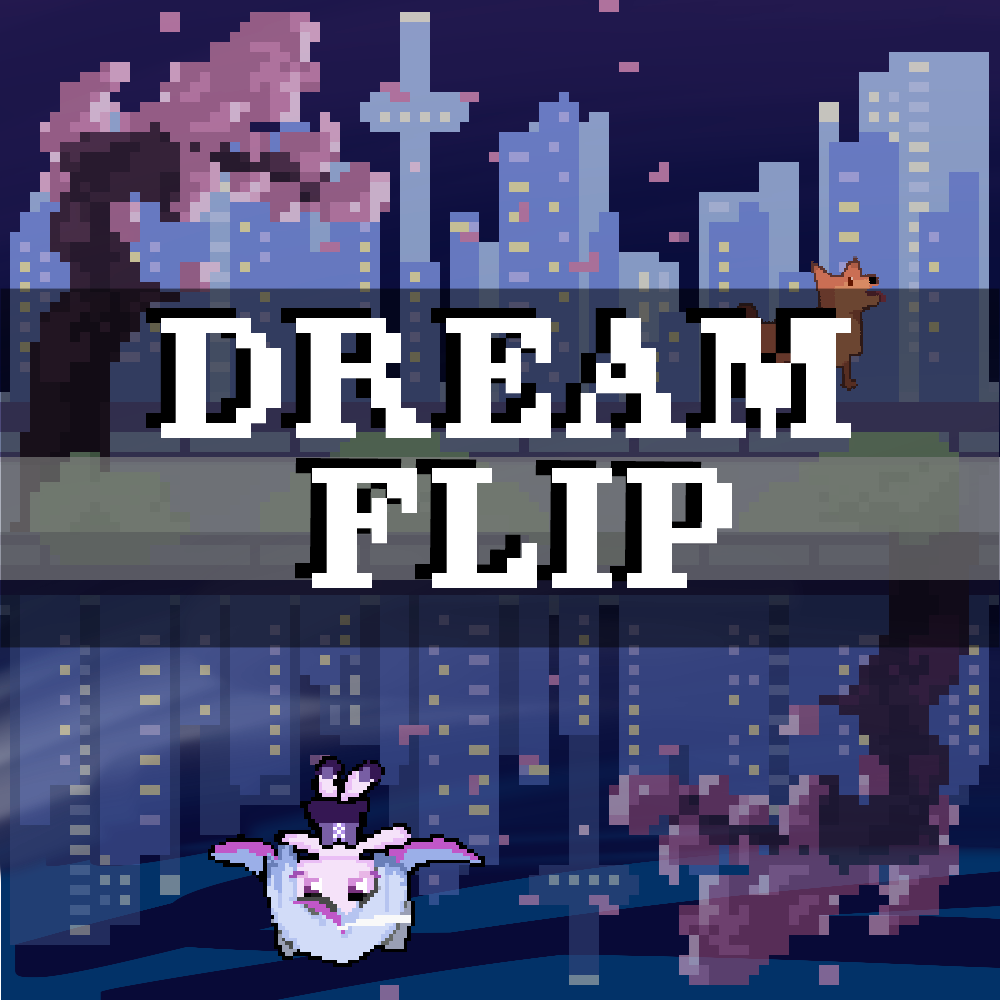

Dream Flip is a platformer based game I developed alongside another programmer and artist. I was in charge of working on player movement, health UI, and gravity control scripts. We worked together to create unique art assests and character animations to match the narrative and transport players into a new world. Our goal was to develop a game in C# that is both challenging and addicting.

You can play the game [here](https://sephye.itch.io/dream-flip).

  

<iframe width="560" height="315" src="https://www.youtube.com/embed/bRt4Dj-3v-0?si=n5vrDePdqGkuosTe" title="YouTube video player" frameborder="0" allow="accelerometer; autoplay; clipboard-write; encrypted-media; gyroscope; picture-in-picture; web-share" referrerpolicy="strict-origin-when-cross-origin" allowfullscreen></iframe>

Source: <a href="https://github.com/zeldaco/The-Pho-Real-Squad.git"><i class="large github icon "><github.com/zeldaco/The-Pho-Real-Squad.git>
