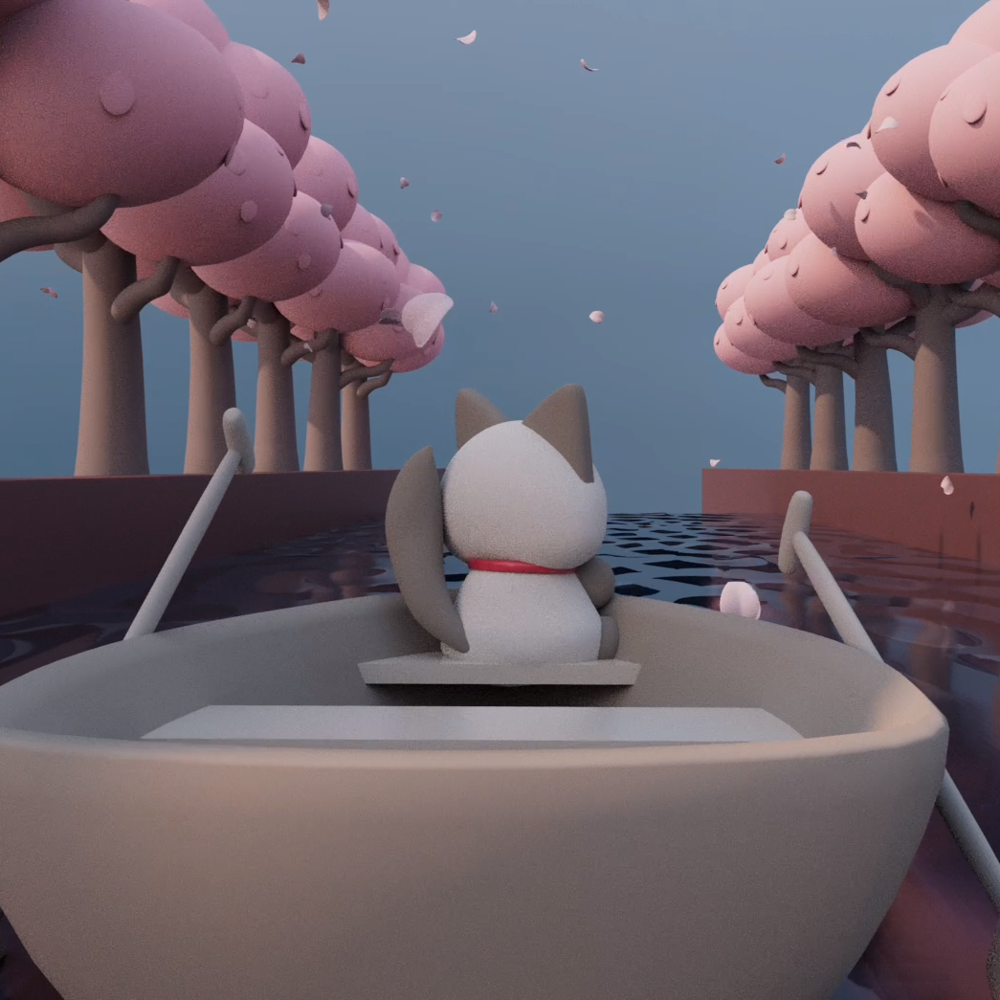
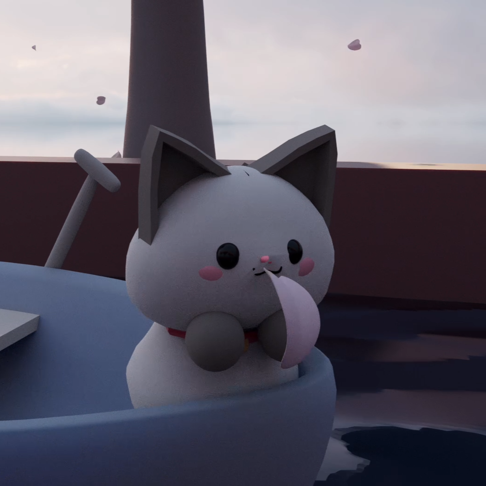

<div class="text-center p-4">
  
  
  
</div>

I used Maya to develop particle systems to create a story of a cat rowing down a river. I developed three particle systems to animate sakura petals falling, the wake of the boat, and a water splash. I learned how to manage scenes and keyframes, develop unique materials, work with shaders and lighting to render the project. I started by modeling all of the different assets, making sure to organize the project so that it would be easy to animate and move specific parts of the models, such as the cats head. Then I worked on the three particle scripts while implementing them into the scene in the right position and frame. 

Here is some code that illustrates how I coded the petal particle system: 

```cpp
byte ADCRead(byte ch)
{
    word value;
    ADC1SC1 = ch;
    while (ADC1SC1_COCO != 1)
    {   // wait until ADC conversion is completed   
    }
    return ADC1RL;  // lower 8-bit value out of 10-bit data from the ADC
}
```

You can learn more at the [UH Micromouse News Announcement](https://manoa.hawaii.edu/news/article.php?aId=2857).
