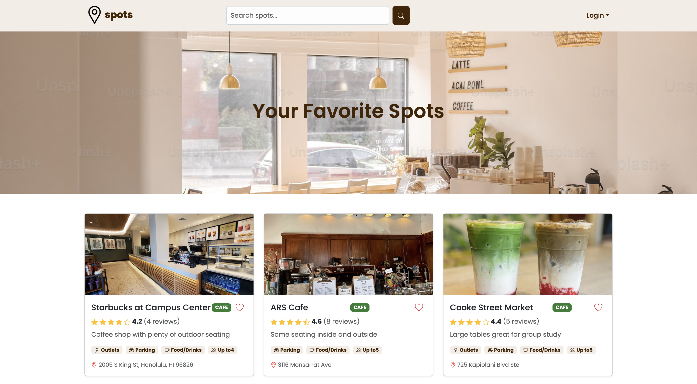
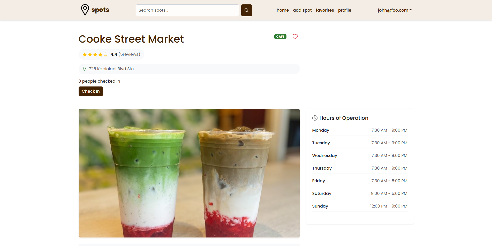
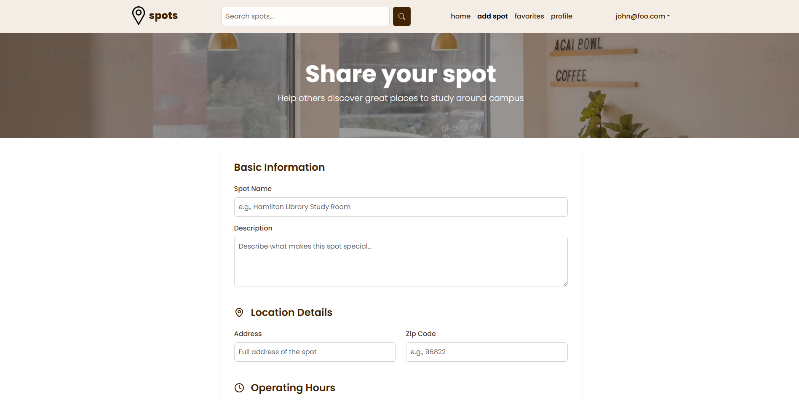
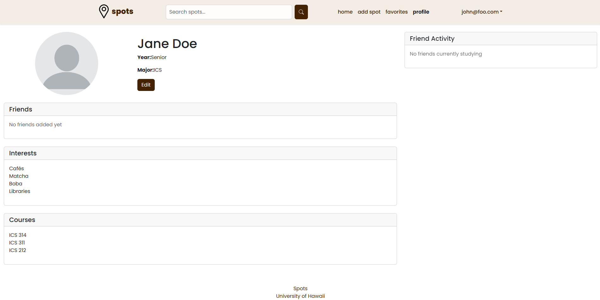

Spots is a web application designed to help UH Manoa students discover and share study locations on and around campus. As a student at UH Manoa, I understand the challenge of finding suitable study spots that match individual preferences and needs. Our team developed this application to create a community-driven platform where students can find, rate, and share study locations.

## My Contribution
As a member of the development team, I focused on implementing several key features:
- Developed the check-in system allowing users to indicate their presence at a location
- Created the busyness indicator functionality to show real-time spot occupancy
- Implemented Spot cards, ability to add new spots, and filter spot search system
- Built API endpoints for managing user check-ins and spot busyness data
- Contributed to the profile page development and user interface design

 

 

## Technologies Used
- **Frontend**: React, Next.js 14, Bootstrap, TypeScript
- **Backend**: Node.js, Prisma ORM
- **Database**: PostgreSQL (hosted on NeonDB)
- **Deployment**: Vercel
- **Version Control**: Git/GitHub

 

## Key Features Implemented

### Check-in System
- Created an intuitive interface for users to check in/out of study spots
- Implemented duration tracking and busyness reporting
- Added real-time updates of spot occupancy

### Friend Activity Tracking
- Developed a feature similar to Spotify's friend activity display
- Shows where friends are currently studying
- Updates in real-time when friends check in or out

### Busyness Indicator
- Built a system to calculate and display current spot occupancy
- Implemented color-coded indicators for different busyness levels
- Created an aggregation system for multiple user reports

 

## Challenges and Learning Outcomes
Throughout this project, I gained valuable experience working with modern web technologies and frameworks. I learned how to implement real-time features and state management, collaborate in a team using Git and agile methodologies in a full-stack environment.

 

## Project Links
- [Organization GitHub Page](https://github.com/manoa-spots)
- [Live Application](https://manoa-spots.vercel.app)
- [Project Documentation](https://manoa-spots.github.io/)

 

## Team Members
Collaborated with Rylee Au, Arissa Dang, and Diana Reis to design and implement this application.
